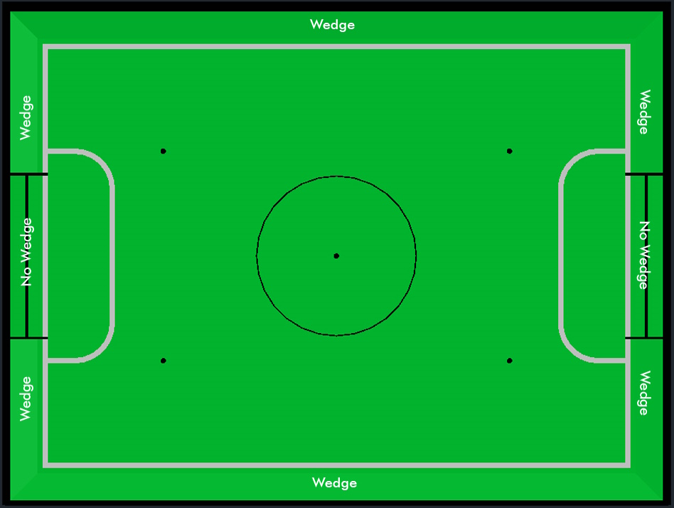
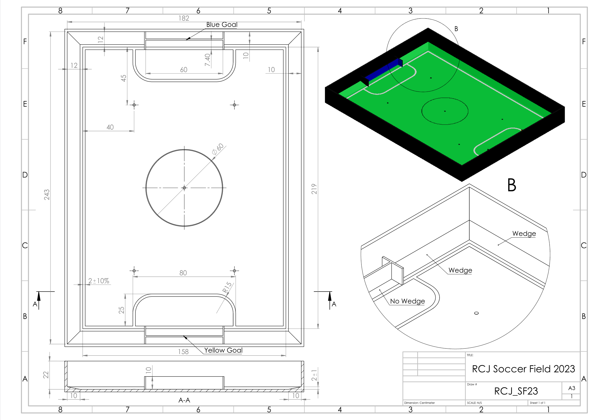

= Especificações Técnicas para Campos de Soccer
{docdate}
:toc: left
:sectanchors:
:sectlinks:
:xrefstyle: full
:section-refsig: Rule
:sectnums:

ifdef::basebackend-html[]
++++
<link rel="stylesheet" href="https://use.fontawesome.com/releases/v5.3.1/css/all.css" integrity="sha384-mzrmE5qonljUremFsqc01SB46JvROS7bZs3IO2EmfFsd15uHvIt+Y8vEf7N7fWAU" crossorigin="anonymous">

++++
endif::basebackend-html[]

:icons: font
:numbered:

[[dimensions-of-the-field]]
== Dimensões do campo

O campo de jogo tem 158 cm por 219 cm. O campo é marcado por uma linha branca que faz
parte do campo de jogo. Ao redor do campo de jogo, além da linha branca, há uma área
externa de 12 cm de largura.

O chão próximo à parede exterior inclui uma rampa, que é uma inclinação com 10 cm de
base e 2 +/- 1 cm de elevação para permitir que a bola role de volta ao jogo quando
sair do campo. Note que o gol não deve conter a rampa.

As dimensões totais do campo, incluindo a área externa, são 182 cm por 243 cm.

[[field-walls]]
== Paredes

Paredes são colocadas ao redor de todo o campo, incluindo atrás dos gols e na área
externa. A altura das paredes é de 22 cm. As paredes são pintadas de preto fosco.

[[goals]]
== Gols

O campo tem dois gols, centralizados em cada um dos lados mais curtos do campo de jogo.
O espaço interno do gol é de 60 cm de largura, 10 cm de altura e 74 mm de profundidade,
em formato de caixa.

As "traves" do gol são posicionadas sobre a linha branca que marca os limites do campo.

As paredes interiores de cada gol são coloridas de forma fosca: um gol amarelo e o outro
azul. Recomenda-se que o azul seja de um tom mais brilhante para que seja suficientemente
diferente do preto exterior.

[[floor]]
== Piso

O piso consiste em carpete verde, idealmente de tom mais escuro, sobre uma superfície
dura e nivelada. As equipes devem estar preparadas para se ajustar a diferentes níveis
de contraste entre o carpete verde e as linhas, pois alguns eventos podem ser limitados
a usar tons mais claros de verde. Todas as linhas do campo devem ser pintadas, marcadas
com fita ou instaladas como carpete branco e ser razoavelmente resistentes a rasgos.
As linhas devem ter 20 mm de largura (±10%).

É impraticável definir restrições internacionais para o carpete além de ser verde. No
espírito da competição, as equipes devem projetar robôs tolerantes ou adaptáveis a
diferentes fibras, texturas, construções, densidades, tons e designs de carpete,
especialmente ao competir entre diferentes regiões. As equipes são encorajadas a
visitar recursos regionais ou entrar em contato com o Comitê de Organização Local
para sugestões caso desejem construir seus próprios campos de treino.

[[neutral-spots]]
== Pontos neutros

Há cinco pontos neutros definidos no campo. Um está no centro do campo. Os outros
quatro estão próximos a cada canto, localizados a 45 cm da borda curta do campo.
Eles se alinham com os lados das áreas de penalidade. Os pontos neutros podem ser
desenhados com um marcador preto fino. Os pontos neutros devem ter formato circular
medindo 1 cm de diâmetro.

[[center-circle]]
== Círculo central

Um círculo central será desenhado no campo. Tem 60 cm de diâmetro. É uma linha fina
de marcador preto. Serve como orientação durante o pontapé inicial.

[[penalty-areas]]
== Áreas de penalidade

Na frente de cada gol há uma área de penalidade de 25 cm de largura e 80 cm de
comprimento com cantos frontais arredondados (raio de 15 cm).

As áreas de penalidade são marcadas por uma linha branca de 20 mm (±10%) de largura.
A linha faz parte da área.

[[lighting-and-magnetic-conditions]]
== Condições de iluminação e magnéticas

Os organizadores do torneio farão o possível para limitar a quantidade de iluminação
externa e interferência magnética. No entanto, os robôs precisam ser construídos de
forma que funcionem em condições imperfeitas (ou seja, sem depender de sensores de
bússola ou condições específicas de iluminação).

[discrete]
[[field-diagrams]]
== DIAGRAMAS DO CAMPO

[.text-center]

[.text-center]

== Modelos CAD do campo

Há arquivos STEP e IGES disponíveis que contêm um modelo dos campos. Estes _não são
autoritativos_ e existem principalmente para fins de ilustração.
footnote:[podem ser encontrados em
https://github.com/robocup-junior/soccer-rules/tree/master/media/CAD]
Você pode visualizar o arquivo STEP com
https://3dviewer.net/#model=https://raw.githubusercontent.com/robocup-junior/soccer-rules/refs/heads/master/media/CAD/SoccerField_202605.step[Visualizador 3D Online]

== Notas sobre construção de campos de soccer

Não existe um *design padrão* para campos — algumas notas da experiência são reunidas
abaixo. Se tiver alguma dúvida, não hesite em perguntar nos canais habituais (Discord,
Fórum, E-mail, todos listados nas regras principais).

=== Obtendo seu primeiro campo — começando pequeno

Se você é uma equipe, escola, etc. que está começando com o RoboCupJunior Soccer,
pode começar com algo muito mais simples e barato do que um campo de competição:
Consiga um carpete verde e fita branca para as linhas e faça um campo básico que você
possa colocar no chão. A próxima melhoria poderia ser algumas paredes (talvez você
tenha papelão ou madeira de sobra que possa pintar de preto e colocar em formato
quadrado). Se crescer além disso, pode ser a hora de construir campos completos
de verdade. Existem designs que podem ser armazenados de forma relativamente fácil
(dobrando ao meio ou sendo desmontados em quartos), mais sobre isso abaixo.

=== Convertendo equipamentos existentes (especialmente para a Liga Entry Level)

// TODO: Inserir link para detalhes da Liga Entry Level
Se você está considerando iniciar na Liga Entry Level e você ou sua escola
possuem campos existentes de qualquer tipo (por exemplo, campos da First Lego League
podem ser convertidos em campos de competição para a Liga Entry Level apenas colocando
carpete e instalando gols). As regras da Liga Entry Level têm explicitamente uma faixa
de tamanho para que equipamentos existentes de diferentes tamanhos possam ser usados.

=== Construindo Campos de Competição

Se você está organizando uma competição, provavelmente está em uma das três situações:

- Você constrói campos que usará para praticar e depois talvez coloca um carpete novo
quando os usa na competição. Muitas competições locais organizadas por escolas que
também participam funcionam dessa forma.
- Você está construindo campos para os quais não tem uso imediato após a grande
competição que está ajudando a organizar. Nesse caso, considere construir campos
adequados (ou seja, duráveis, transportáveis e armazenáveis) para serem distribuídos
a organizadores de competições locais/regionais ou escolas participantes da região
para apoiar a RoboCupJunior, em vez de serem descartados.
- Você está usando campos que já possui.

Claro que também pode ser uma combinação dessas situações ou algo completamente
diferente.

=== Condições de competição

Se você está organizando competições, vale a pena garantir que todos os carpetes usem
o mesmo material, que todas as paredes e gols tenham o mesmo acabamento de superfície
(sem diferenças fosco/brilhante entre campos, sem diferenças de tom de cor entre os
gols e assim por diante). As equipes apreciam muito isso porque facilita muito o
trabalho de calibração. Isso também se aplica a ter iluminação uniforme. O mínimo
possível de luz natural (porque tende a variar muito) e posicionamento dos campos de
forma que haja uma quantidade semelhante de luz (smartphones podem medir isso bem)
e o mínimo possível de sombra nos campos.

Se você planeja usar seus campos por um período prolongado, evite fibras de madeira
(MDF, etc.). Compensado de qualidade funciona muito bem, mas é caro — então investir
nisso depois de desgastar um campo barato pode ser uma opção. Os impactos dos robôs
nas paredes e gols diminuíram muito com as mudanças de regras de 2022-2024, mas já
tivemos gols arrancados de campos no passado. Montar e desmontar campos (o que você
pode ter que fazer se tiver espaço limitado e precisar armazená-los quando não estiver
em uso ou se tiver que transportá-los para um local para organizar um torneio regular)
também causa desgaste nos campos.
