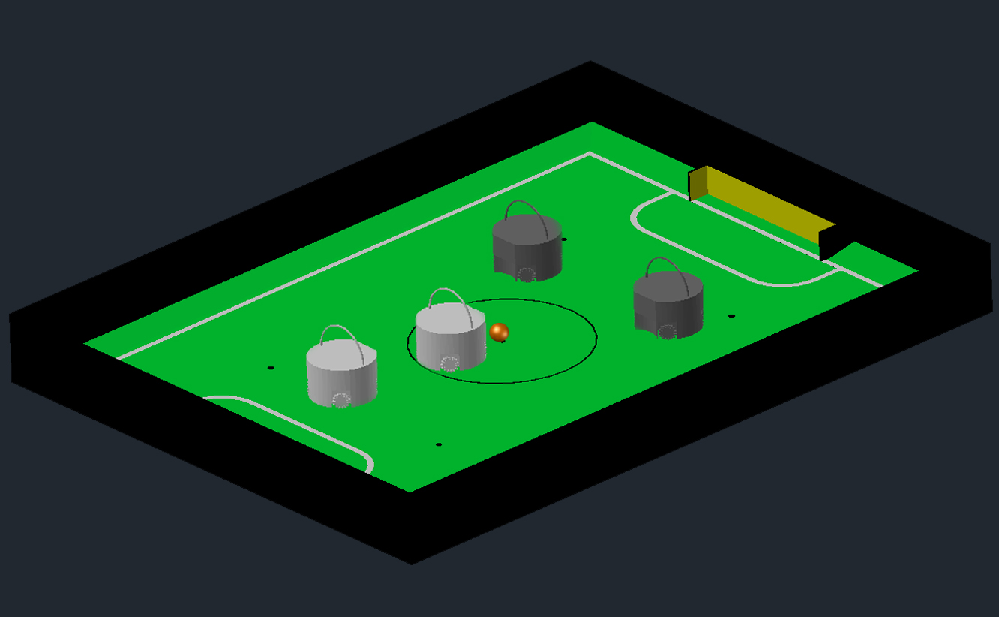
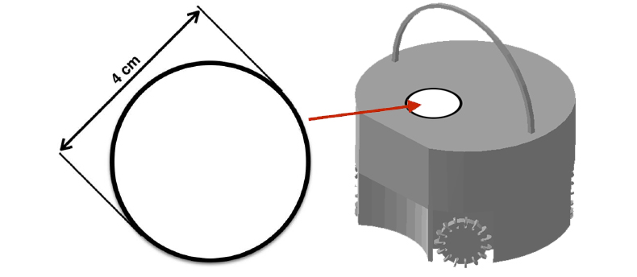

= Regras RoboCupJunior Soccer 2026
{docdate}
:toc: left
:sectanchors:
:sectlinks:
:xrefstyle: full
:section-refsig: Rule
:sectnums:

ifdef::basebackend-html[]
++++
<link rel="stylesheet" href="https://use.fontawesome.com/releases/v5.3.1/css/all.css" integrity="sha384-mzrmE5qonljUremFsqc01SB46JvROS7bZs3IO2EmfFsd15uHvIt+Y8vEf7N7fWAU" crossorigin="anonymous">

++++
endif::basebackend-html[]

:icons: font
:numbered:

IMPORTANT: Este documento é uma *tradução e adaptação das regras oficiais da
RoboCupJunior Soccer*, direcionada à *liga brasileira (RoboCupJunior Brasil)*.
Em caso de divergência, a versão oficial em inglês tem prioridade.

Estas são as regras de Soccer para a RoboCupJunior 2026, adaptadas das regras
gerais da RoboCupJunior Soccer League para uso no contexto brasileiro. A versão
em inglês das regras oficiais tem prioridade sobre qualquer tradução.

As equipes são aconselhadas a verificar o site RoboCupJunior Soccer
footnote:[https://junior.robocup.org/] e o fórum Soccer
footnote:[https://junior.forum.robocup.org/c/robocupjunior-soccer/5]
para obter os procedimentos e requisitos para a competição internacional.
Para competições locais, regionais e super-regionais, consulte os organizadores
dos torneios. Cada equipe é responsável por verificar a versão mais recente das
regras antes de cada competição. Equipes devem solicitar esclarecimentos no
Fórum sempre que necessário.
footnote:[A versão atual dessas regras pode ser encontrada em
https://robocup-junior.github.io/soccer-rules/master/rules.html em formato HTML e
em https://robocup-junior.github.io/soccer-rules/master/rules.pdf em formato PDF.]

TIP: As equipes são encorajadas a entrar em contato com a comunidade RoboCupJunior
em nosso Discord. Mostre o que você está trabalhando, faça perguntas ou participe
das discussões semanais sobre futuras regras e design da liga.
footnote:[Você pode entrar no servidor em
https://robocup-junior.github.io/soccer-rules/discord/]
Você também pode contatar o Comitê da Soccer League diretamente por e-mail
footnote:[robocupjunior-soccer [ at \] robocup [ dot \] org]

[title="Duas equipes de dois robôs com uma bola laranja em um campo de futebol RoboCupJunior."]

[discrete]
== Prefácio

No desafio RoboCupJunior Soccer, equipes de jovens engenheiros projetam, constroem
e programam dois robôs móveis totalmente autônomos para competir contra outro time em
partidas. Os robôs devem detectar uma bola e marcar em um gol codificado por cores
em um campo especial que se assemelha a um campo de futebol humano.

Para ter sucesso, os participantes devem demonstrar habilidade em programação, robótica,
eletrônica e mecatrônica. Espera-se também que as equipes contribuam para o avanço da
comunidade como um todo, compartilhando suas descobertas com outros participantes e
praticando o bom espírito esportivo, independentemente da cultura, idade ou resultado
da competição. *Espera-se que todos compitam, aprendam, se divirtam e cresçam.*

A RoboCupJunior Soccer consiste em duas sub-ligas: {~~Soccer Open~>Soccer Vision
(anteriormente Soccer Open)~~} e {~~Soccer Lightweight~>Soccer Infrared
(anteriormente Soccer Lightweight)~~}. Este documento cobre apenas as sub-ligas
Soccer Vision e Soccer Infrared. As principais diferenças entre as sub-ligas
Soccer Vision e Soccer Infrared são:

* O {~~Soccer Lightweight~>Soccer Infrared~~} é jogado com uma bola especial que
emite sinal IR. Os robôs podem pesar até {~~1,4 kg~>1,5 kg~~} e ter até 22 cm.

* O {~~Soccer Open~>Soccer Vision~~} é jogado com uma bola de golfe laranja. Os robôs
não têm restrição de peso e podem ter até 18 cm.

IMPORTANT: Grande parte do ranking geral (para o torneio internacional; outros
torneios podem funcionar de forma diferente) é determinada pelas categorias avaliadas.
Há pontos para documentação, desempenho em entrevista, etc.
footnote:[
veja https://robocup-junior.github.io/soccer-rules/master/scoring.pdf
ou https://robocup-junior.github.io/soccer-rules/master/scoring.html
]

TIP: A liga Soccer está planejando aumentar o tamanho das equipes para 5. A partir
de 23 de abril de 2026, está confirmado que um tamanho máximo de 4 membros por equipe será
permitido na competição de Incheon. Recomendamos equipes de 5 para Super-Regionais
e onde os organizadores acharem prático também para competições regionais e locais.
Consulte os organizadores de cada torneio que participar sobre o tamanho de equipe
que podem acomodar. Informações de contato para o campeonato mundial:
robocupjunior-soccer [ at \] robocup [ dot \] org

[[general-rules]]
include::general-rules_PtBR.adoc[]

[discrete]
=== Mudanças nas Regras RoboCupJunior Soccer 2025

// TODO: Resumir as mudanças aqui
As mudanças nas regras desenvolvidas pelo Comitê da Liga de Soccer em cooperação com a
Comunidade RoboCup Junior Soccer (por favor, continue postando ideias para o futuro a
qualquer momento) visam melhorar a jogabilidade.

Alterações detalhadas estão listadas abaixo e vinculadas ao local correspondente nas regras.

{+-~TOC-CHANGES~-+}

[[gameplay]]
== JOGABILIDADE

[[game-procedure-and-length-of-a-game]]
=== Procedimento de jogo e duração de uma partida

As partidas RCJ Soccer consistem em dois times de robôs jogando futebol um contra o
outro. Cada equipe tem dois robôs autônomos. O jogo será composto por dois tempos.
A duração de cada tempo é de 10 minutos. Haverá um intervalo de 5 minutos entre os tempos.

Espera-se que as equipes estejam em campo 5 minutos antes do início do jogo. Estar na
mesa de inspeção não conta a favor desse limite de tempo. As equipes que se atrasarem
para o início do jogo podem ser penalizadas em um gol a cada *30 segundos*, a critério
do árbitro.

O placar final do jogo será limitado para que haja no máximo 10 gols de diferença entre
o time perdedor e o time vencedor.

[[pre-match-meeting]]
=== Reunião pré-jogo

No início do primeiro tempo do jogo, um árbitro lançará uma moeda. A equipe mencionada
primeiro no sorteio deve chamar a moeda. O vencedor do sorteio pode escolher para qual
extremidade chutar ou chutar primeiro. O perdedor do sorteio escolhe a outra opção.
Após o primeiro tempo, as equipes trocam de lado. A equipe que não deu o pontapé inicial
no primeiro tempo dará o pontapé inicial para iniciar o segundo tempo.

Durante a reunião pré-jogo, o(s) árbitro(s) pode(m) verificar se os robôs são capazes
de jogar (ou seja, se eles são pelo menos capazes de seguir e reagir à bola). Se nenhum
dos robôs for capaz de jogar, o jogo não será disputado e zero gols serão concedidos a
ambas as equipes.

[[kick-off]]
=== Pontapé inicial

Cada tempo do jogo começa com um pontapé inicial. Todos os robôs devem estar localizados
em seu próprio lado do campo. Todos os robôs devem estar parados. A bola é posicionada
por um árbitro no centro do campo.

A equipe que dá o pontapé inicial coloca seus robôs no campo primeiro.

A equipe que não deu o pontapé inicial colocará seus robôs no lado defensivo do campo.
Todos os robôs da equipe que não está dando o pontapé inicial devem estar a pelo menos
30 cm de distância da bola (fora do círculo central).

Os robôs não podem ser colocados fora dos limites. Os robôs não podem ser reposicionados
depois de colocados, exceto se o árbitro solicitar um ajuste de posicionamento para
garantir que os robôs estejam posicionados corretamente dentro do campo.

Ao comando do árbitro (geralmente por apito), todos os robôs serão iniciados
imediatamente. Quaisquer robôs iniciados antecipadamente serão removidos do campo
pelo árbitro e considerados danificados.

Antes de um pontapé inicial, *todos os robôs danificados ou fora dos limites* têm
permissão de retornar ao campo de jogo imediatamente se estiverem _prontos e
totalmente funcionais_.

[[neutral-kickoff]]
==== Pontapé inicial neutro

Um pontapé inicial neutro é o mesmo descrito em <<kick-off>> com uma pequena
alteração: todos os robôs devem estar a pelo menos 30 cm de distância da bola
(fora do círculo central).

[[scoring]]
=== Pontuação

Um gol é marcado quando a bola atinge ou toca a parede do fundo do gol. Os gols
marcados por qualquer robô têm o mesmo resultado final: concedem um gol para o time
do lado oposto. Após um gol, o jogo será reiniciado com um pontapé inicial da equipe
que sofreu o gol.

[[ball-movement]]
=== Movimento da bola

Um robô não pode segurar a bola. Segurar a bola é definido como assumir o controle
total dela, removendo todos os graus de liberdade. Exemplos de segurar a bola incluem
fixar a bola ao corpo do robô, cercar a bola usando o corpo do robô para impedir o
acesso de outros, encircular ou prender a bola com qualquer parte do corpo do robô.
Se a bola não rolar enquanto um robô estiver se movendo, é uma boa indicação de que
a bola está presa.

A única exceção é o uso de um tambor giratório (um "driblador") que imprime um giro
dinâmico para trás na bola para mantê-la em sua superfície.

Outros jogadores devem poder acessar a bola.

A bola precisa permanecer dentro dos limites do campo, conforme definido pelas paredes.
Se um robô mover a bola para fora do campo (ou seja, além das paredes ou acima de sua
altura), será considerado danificado. (<<damaged-robots>>)

Qualquer robô deve se aproximar e tocar a bola quando ela for colocada no ponto neutro
mais próximo. Deve fazer isso antes que a falta de progresso seja sinalizada. Quando
estiver em seu próprio lado do campo, qualquer robô deve ser capaz de mover a bola do
ponto neutro mais próximo para o lado adversário. Se um robô específico não agir
desta forma, os árbitros poderão considerá-lo danificado a seu critério.
(Veja <<damaged-robots, Robôs Danificados>>.) Esta regra não se aplica se o robô for
impedido de detectar ou jogar a bola pelo adversário.

[[inside-penalty-area]]
=== Dentro da Área de Pênalti (Empurrão e Defesa Múltipla)

Nenhum robô pode estar totalmente dentro da área de penalidade. Como as áreas de
penalidade são marcadas com uma linha branca, a regra de Fora dos Limites se aplica.
(<<out-of-bounds>>)

Se dois robôs da mesma equipe estiverem pelo menos parcialmente em uma área de
penalidade, o robô mais distante da bola será movido para o _ponto neutro desocupado
mais distante_ imediatamente. Se isso ocorrer repetidamente, um robô poderá ser
considerado danificado a critério do árbitro. (<<damaged-robots>>)

Se um robô atacante e um defensor se tocarem enquanto pelo menos um deles estiver pelo
menos parcialmente dentro da área de penalidade, e pelo menos um deles tiver contato
físico com a bola, isso pode ser chamado de "empurrão" a critério do árbitro. Neste
caso, a bola será movida para o _ponto neutro desocupado mais distante_ imediatamente.

Se um gol for marcado como resultado de uma situação de "empurrão", ele não será
concedido.

{++ Se o empurrão e a defesa múltipla ocorrerem simultaneamente, os árbitros chamarão
e resolverão primeiro a situação de empurrão, depois a defesa múltipla.++}

[[lack-of-progress]]
=== Falta de progresso

A falta de progresso ocorre se não houver progresso no jogo por um período razoável
de tempo e a situação provavelmente não mudar. Situações típicas de falta de progresso
são quando a bola está presa entre os robôs, quando não há mudança nas posições da
bola e dos robôs, ou quando a bola está além da detecção ou alcance de todos os robôs
no campo.

Após uma contagem visível e em voz alta footnote:[geralmente uma contagem de três],
um árbitro informará `*falta de progresso*` e moverá a bola para o ponto neutro
desocupado mais próximo. Se isso não resolver a falta de progresso, o árbitro poderá
chamar falta de progresso novamente e mover a bola para um ponto neutro diferente.

[[out-of-bounds]]
=== Fora dos limites

Se um robô tocar uma parede ou se mover completamente para dentro da área de penalidade,
será chamado `*fora dos limites*`. Quando essa situação ocorrer, o robô receberá uma
penalidade de um minuto e será removido do campo. Não há interrupção do tempo para o
jogo em si. O robô pode retornar se um pontapé inicial ocorrer antes que a penalidade
tenha decorrido.

A penalidade de um minuto começa quando o robô é removido do jogo. Além disso, qualquer
gol marcado pela equipe penalizada enquanto o robô penalizado estiver em campo não será
concedido. Os robôs fora dos limites podem ser consertados se a equipe precisar, conforme
descrito em <<damaged-robots>>.

Após o término da penalidade, o robô será colocado no ponto neutro desocupado mais
distante da bola, de frente para seu próprio gol.

Um árbitro pode dispensar a penalidade se o robô for acidentalmente empurrado para fora
de campo por um robô adversário. Nesse caso, o árbitro {++chamará "empurrado para fora"++}
e poderá empurrar levemente o robô de volta ao campo.

[[damaged-robots]]
=== Robôs danificados

Se um robô for danificado, ele deve ser retirado do campo e deve ser consertado antes
que possa jogar novamente. Mesmo que consertado, o robô deve permanecer fora de campo
por pelo menos um minuto ou até o próximo pontapé inicial.

Alguns exemplos de robô danificado:

* não responde à bola ou não consegue se mover (perdeu peças, energia, etc.).
* move-se continuamente para dentro da área de penalidade ou para fora dos limites.
* vira por conta própria.

Após ser consertado, o robô será colocado no ponto neutro desocupado mais distante da
bola, de frente para seu próprio gol.

*Somente o árbitro decide se um robô está danificado.* Um robô só pode ser retirado
ou devolvido com a permissão do árbitro.

Se ambos os robôs de uma mesma equipe forem considerados danificados no pontapé inicial,
o jogo será pausado e a equipe restante receberá 1 gol a cada 30 segundos que os robôs
adversários permanecerem danificados. Contudo, essas regras só se aplicam quando nenhum
dos dois robôs da mesma equipe foram danificados como resultado de violação de regras
pela equipe adversária.

Sempre que um robô for removido do jogo, seus motores devem ser desligados.

[[human-interference]]
=== Interferência humana

Exceto para o pontapé inicial, a interferência humana das equipes (por exemplo, tocar
os robôs) durante o jogo não é permitida, a menos que explicitamente permitida por um
árbitro. A(s) equipe(s)/membro(s) da equipe infratores poderão ser desqualificados do jogo.

O(s) árbitro(s) pode(m) ajudar robôs a se soltarem se a bola não estiver sendo disputada
próxima a eles e se a situação tiver sido criada a partir da interação normal entre robôs
(ou seja, não foi uma falha de projeto ou programação do robô sozinho). O(s) árbitro(s)
puxará(ão) os robôs apenas o suficiente para que possam se mover livremente novamente.

[[interruption-of-game-ref-interruption]]
=== Interrupção do Jogo

Em princípio, um jogo não será interrompido.

Um árbitro pode interromper o jogo se houver uma situação no campo ou ao redor dele
que o árbitro queira discutir com um oficial do torneio, ou se a bola apresentar defeito
e uma substituta não estiver prontamente disponível.

Quando o árbitro interromper o jogo, todos os robôs devem ser parados e permanecer no
campo sem serem tocados. O árbitro decidirá se o jogo será continuado/retomado a partir
da situação em que foi interrompido ou mediante um pontapé inicial neutro.

[[robots]]
== ROBÔS

[[robots-interference]]
=== Interferência

Robôs não podem ser coloridos de laranja, amarelo ou azul para evitar interferência.
Peças laranja, amarelas ou azuis usadas na construção do robô devem ser ocultadas por
outras partes para não serem percebidas por outros robôs, ou devem ser cobertas com
tinta ou fita de cor neutra.

Robôs não devem produzir interferência magnética em outros robôs no campo.

Robôs não devem produzir luz visível que possa impedir a equipe adversária de jogar
quando colocados em uma superfície plana. Qualquer parte do robô que produza luz que
possa interferir no sistema de visão do robô adversário deve ser coberta.
Para regulamentações específicas da sub-liga Soccer Infrared, veja <<regulations-inference-in-infrared>>

IMPORTANT: {++Essas regras de interferência significam que frequentemente luzes
vermelhas (por exemplo, sensores de linha) são detectadas pelos sistemas de câmera
de outras equipes como a bola laranja e, portanto, devem ser cobertas para que o robô
seja autorizado a jogar. Isso já ocorre na Vision há muitos anos, mas pode ser novo
para equipes da Infrared. As equipes são aconselhadas a garantir que seus robôs não
tenham essas luzes/peças vermelhas brilhantes para evitar ajustes surpresa na
competição.++}

Espera-se que os robôs sejam capazes de lidar com qualquer cor visível acima das paredes
(por exemplo, camisetas azuis, amarelas, verdes ou laranja), seja por hardware (por
exemplo, limitando o campo de visão para não olhar para cima) ou por software (por
exemplo, mascarando a imagem de entrada).

O árbitro pode interromper um jogo em andamento se qualquer tipo de interferência dos
espectadores for suspeita (emissores IR, flashes de câmera, celulares, rádios,
computadores, etc.).

Uma equipe que afirmar que seu robô está sendo afetado pelo robô da outra equipe deve
fornecer prova ou evidência da interferência. Qualquer interferência precisa ser
confirmada pelos organizadores do torneio se uma reclamação for feita pela outra equipe.

[[robots-control]]
=== Controle e Comunicação

O uso de controle remoto de qualquer tipo não é permitido durante a partida. Os robôs
devem ser controlados de forma autônoma.

Para {~~apenas o Campeonato Mundial, a partir do Brasil 2025,~>pelo menos no campeonato
mundial (consulte outros organizadores de competições)~~} é obrigatório o uso de um
Módulo de Comunicações para os árbitros controlarem os robôs.
Veja <<international-competition-specifics>>

[[agility]]
=== Agilidade

Os robôs devem ser construídos e programados de forma que seu movimento não seja
limitado a apenas uma dimensão (definida como um único eixo, como mover-se apenas em
linha reta). Eles devem se mover em todas as direções, por exemplo, girando.

[[handle]]
=== Alça

Todos os robôs devem ter uma alça estável e facilmente perceptível para segurá-los e
levantá-los. A alça deve ser facilmente acessível e permitir que o robô seja levantado
a partir de pelo menos 5 cm acima da estrutura mais alta do robô. Deve haver um espaço
mínimo de 5 cm para as mãos entre a parte não-alça mais alta do robô e a alça.

As dimensões da alça podem exceder o limite de altura do robô, mas a parte da alça que
excede esse limite não pode ser usada para montar componentes do robô.

O peso do robô inclui o da alça.

[[top-markers]]
=== Marcadores Superiores

Um robô deve ter marcações para ser distinguido pelo árbitro. Cada robô deve ter um
círculo de plástico branco com diâmetro mínimo de 4 cm montado horizontalmente no
topo. Este círculo branco será usado pelo árbitro para escrever números nos robôs com
marcadores, portanto os círculos brancos devem ser acessíveis e visíveis. Os marcadores
superiores não precisam estar dentro do limite de tamanho do robô.

Antes do jogo, o árbitro designará os números para cada robô e os escreverá no círculo
branco superior. Robôs sem o círculo branco superior não estão aptos para jogar.

.Visualização do marcador superior

[[violations]]
=== Violações

Robôs que não atendem às especificações/regulamentos (veja <<regulations>>) não estão
autorizados a jogar, a menos que estas regras especifiquem o contrário.

Se violações forem detectadas durante um jogo em andamento, a equipe poderá ser
desqualificada daquele jogo.

Se violações semelhantes ocorrerem repetidamente, a equipe poderá ser desqualificada
do torneio.

[[specifications]]
=== Especificações de materiais

Especificações detalhadas da bola e dos campos podem ser encontradas na nota de rodapé
footnote:[
https://robocup-junior.github.io/soccer-rules/master/field_specification.pdf
ou https://robocup-junior.github.io/soccer-rules/master/field_specification.html
e https://robocup-junior.github.io/soccer-rules/master/ball_specification.pdf
ou https://robocup-junior.github.io/soccer-rules/master/ball_specification.html respectivamente].

[[infrared-ball-change]]
=== Mudança de Bola da Liga Soccer Infrared 2026

{++A partir deste ano (2026), o Soccer Infrared está usando uma nova bola IR.
A principal diferença desta bola é a mudança de tamanho de 74 mm para 42 mm de diâmetro,
o mesmo tamanho da bola de golfe da sub-liga Soccer Vision.++}
{++Esta bola é Open Source, portanto qualquer pessoa pode produzi-la a partir dos
arquivos e instruções na página do GitHub:
https://github.com/robocup-junior/ir-golf-ball .++}
{++Se você ou alguém que conhece puder ajudar produzindo ou distribuindo bolas para
uma ou mais regiões, o Comitê de Soccer está interessado em ajudar a viabilizar isso
e em listar você como fornecedor de bolas no site oficial. Entre em contato pelo
Fórum, Discord ou e-mail++}

[[tournament-balls]]
=== Bolas do torneio

As bolas para o torneio devem ser disponibilizadas pelos organizadores do torneio.
Os organizadores do torneio não são responsáveis por fornecer bolas para treino.

[[code-of-conduct]]
== CÓDIGO DE CONDUTA

[[fair-play]]
=== Jogo Limpo

Espera-se que o objetivo de todas as equipes seja jogar uma partida justa e limpa de
futebol robótico. Espera-se que todos os robôs sejam construídos com consideração
pelos outros participantes.

Os robôs não são permitidos a causar interferência deliberada ou danos a outros robôs
durante o jogo normal.

Os robôs não são permitidos a causar danos ao campo ou à bola durante o jogo normal.

Um robô que cause danos poderá ser desqualificado de uma partida específica a critério
do organizador do torneio.

Humanos não são permitidos a causar interferência deliberada com robôs ou danos ao
campo ou à bola.

[[conflict-resolution]]
== RESOLUÇÃO DE CONFLITOS

[[referees]]
=== Árbitros

O(s) árbitro(s) é(são) responsável(is) por tomar decisões em relação ao jogo, de
acordo com estas regras.

*Durante o jogo, as decisões tomadas pelo(s) árbitro(s) são definitivas.*

Apenas o(s) membro(s) da equipe no banco têm mandato para falar livremente com o(s)
árbitro(s).

Ao final do jogo, os resultados tornam-se definitivos com as assinaturas de ambas as
equipes. Disputas devem ser resolvidas antes da assinatura.

[[rule-clarification]]
=== Esclarecimento de regras

Esclarecimentos de regras podem ser feitos por membros dos organizadores do torneio e
do Comitê da Liga de Soccer, se necessário, inclusive durante um torneio.

[[rule-modification]]
=== Modificação de regras

Se circunstâncias especiais, como problemas imprevistos ou capacidades de um robô,
ocorrerem, as regras podem ser modificadas pelos organizadores do torneio, se necessário,
inclusive durante um torneio.

[[competition-specifics]]
=== Especificidades da competição

Cada competição (desde local até internacional) pode ter regras adaptadas e
especificidades adicionadas (pontuação, entrevistas, modos de torneio, variações de
regras, etc.). Verifique com os organizadores de cada torneio do qual participar.
Competições regionais e super-regionais possuem regras baseadas na regra oficial e
podem divergir um pouco desta versão brasileira.

[[league-regulations]]
== REGULAMENTOS DA LIGA

[[league-regulations-preamble]]
=== Preâmbulo

Para a RoboCupJunior, existem duas sub-ligas: Soccer {~~Lightweight~>Infrared~~}
e Soccer {~~Open~>Vision~~}.

As partidas da sub-liga Soccer {~~Open~>Vision~~} são disputadas com uma bola de golfe
laranja (passiva), enquanto as partidas da sub-liga Soccer {~~Lightweight~>Infrared~~}
são jogadas com a bola IR. Esta seção de regulamentos se aplica às sub-ligas
Soccer Vision e Soccer Infrared.
footnote:[para especificações detalhadas da bola veja: <<specifications>>]

[[regulations]]
=== Regulamentos

[[dimensions]]
==== Dimensões

Os robôs serão medidos em posição ereta com todas as partes estendidas. As dimensões
de um robô não devem exceder os seguintes limites:

|===
|sub-liga | Soccer {~~Open~>Vision~~} | Soccer {~~Lightweight~>Infrared~~}
|tamanho ^[0]^  | 18,0 cm | 22,0 cm +
|altura | 18,0 cm | 22,0 cm +
|peso | Sem limite | {~~1400 g~>1500g~~} +
|zona de captura de bola | 1,5 cm | {~~3,0 cm~>1,5 cm~~} +
|===

TIP: [0] O robô deve caber suavemente em um cilindro deste diâmetro. {++Estar 3 mm
abaixo do limite de tamanho e 50 g abaixo do limite de peso geralmente tornará as
inspeções mais tranquilas.++}

A zona de captura de bola é definida como qualquer espaço interno criado quando uma
régua é colocada sobre os pontos salientes de um robô. Isso significa que a bola não
deve entrar no casco convexo do robô por mais que a profundidade especificada. Além
disso, deve ser possível para outro robô tomar posse da bola.

[[regulations-inference-in-infrared]]
==== Interferência infravermelha

{++*SOMENTE PARA A LIGA INFRARED:*++} Componentes projetados para emitir IR (por exemplo,
ToF, LiDAR, sensores de distância IR, LEDs/LASERs IR, etc.) não são permitidos e os
organizadores do torneio exigirão que tais dispositivos sejam removidos ou cobertos.

[[regulations-limitations]]
==== Limitações

Um robô pode usar qualquer número de câmeras sem restrições em lentes, peças ópticas,
sistemas ópticos e campo de visão total. Os componentes podem ser obtidos de qualquer
forma que a equipe considerar adequada.

A força do chutador está sujeita a verificação de conformidade a qualquer momento
durante a competição. Durante o jogo, um árbitro pode {~~pedir para ver um chute de
amostra~>testar a potência do chutador~~} no campo antes de cada tempo, quando um
robô danificado retornar ao campo ou quando o jogo estiver prestes a ser reiniciado
após um gol.
Veja <<kicker-power-measuring>> para mais detalhes.

[[regulations-inspections]]
==== Inspeções

Os robôs devem ser inspecionados e certificados todos os dias antes do primeiro jogo.
Os organizadores do torneio podem solicitar outras inspeções, se necessário, incluindo
inspeções aleatórias que podem ocorrer a qualquer momento.

[[international-competition]]
== COMPETIÇÃO INTERNACIONAL

[[international-competition-specifics]]
=== Especificidades da Competição Internacional

Na competição internacional (para outras competições, consulte os organizadores), o
Comitê da Liga Soccer fornecerá a cada equipe um Módulo de Comunicação. Isso permite
uma coordenação mais fácil dos jogos e o controle dos robôs pelos árbitros durante as
partidas. Espera-se que cada equipe faça interface com este módulo usando um único
pino GPIO de 2,54 mm para iniciar e parar os robôs. O Comitê da Liga Soccer planeja
expandir isso para usar UART para aplicações mais complexas em anos futuros. Consulte
a página do GitHub para mais informações sobre o módulo:
https://github.com/robocup-junior/soccer-communication-module

O módulo em si pode exceder a altura máxima do robô. Deve ser posicionado a pelo menos
1 cm de distância do lado externo e protegido contra danos por impacto.

[[interviews]]
=== Entrevistas

Durante a competição internacional, os organizadores do torneio podem organizar
entrevistas com as equipes durante o Dia de Configuração do evento. Isso significa que
as equipes precisam estar presentes desde cedo neste dia.

Detalhes sobre o que é exigido e o que esperar das entrevistas podem ser encontrados
no documento de pontuação disponível aqui footnote:[
https://robocup-junior.github.io/soccer-rules/master/scoring.pdf ou
https://robocup-junior.github.io/soccer-rules/master/scoring.html].

O Comitê da Liga Soccer recomenda a implementação de entrevistas em competições
regionais também, mas isso não é obrigatório. As equipes devem verificar com os
organizadores do torneio se realizam entrevistas e, em caso afirmativo, que tipo de
entrevista esperar.

[[technical-challenges]]
=== Desafios Técnicos

Inspirado pelas ligas principais e pela necessidade de avanço tecnológico adicional
das ligas, o Comitê da Liga Soccer realiza os chamados *Desafios Técnicos*. Novos
desafios são adicionados a cada ano e são desconhecidos até durante a Competição
Internacional.

A ideia desses desafios é dar às equipes a oportunidade de demonstrar diversas
habilidades de seus robôs que podem não ser percebidas durante os jogos regulares.
Além disso, o Comitê da Liga Soccer visa esses desafios como um espaço para testar
novas ideias que podem se tornar futuras regras ou moldar a competição de outras formas.

Qualquer equipe RoboCupJunior Soccer estará apta a tentar esses desafios.

[[further-information-on-international-competition]]
=== Mais informações sobre a Competição Internacional

Todas as equipes qualificadas para a competição internacional *devem* compartilhar
seus projetos, tanto hardware quanto software, com todos os participantes presentes
e futuros. Essas equipes também devem enviar um portfólio digital antes da competição.
Mais detalhes sobre como será fornecido pelo Comitê da Liga Soccer, que atua como
organizador do torneio para a competição internacional.

Durante os dias de competição da competição internacional (bem como antes do evento),
os membros das equipes são responsáveis por verificar todas as informações relevantes
publicadas pelo Comitê da Liga Soccer ou qualquer outro oficial da RoboCup.

Haverá também uma competição SuperTeam, na qual várias equipes de todo o mundo
compartilham seus robôs em um "SuperTeam" e jogam contra outros SuperTeams em um
chamado "Big Field". As equipes podem utilizar diferentes lentes de câmera ou sensores
otimizados para os campos maiores para melhorar seu desempenho. As regras completas
deste desafio podem ser encontradas em
https://robocup-junior.github.io/soccer-rules/master/superteam_rules.html ou
https://robocup-junior.github.io/soccer-rules/master/superteam_rules.pdf

As equipes que competem na competição internacional podem receber prêmios por seu
desempenho. Esses prêmios são decididos e introduzidos pelo Comitê da Liga Soccer,
que publica todos os detalhes necessários com antecedência ao evento real.
footnote:[para detalhes veja
https://robocup-junior.github.io/soccer-rules/master/scoring.pdf ou
https://robocup-junior.github.io/soccer-rules/master/scoring.html]

[appendix]
[[kicker-power-measuring]]
== Procedimentos de Medição de Potência do Chutador

Todos os chutadores dos robôs serão testados com a bola do torneio usada na sub-liga
em que participam.
A potência do chutador será medida por meio de um teste em campo.
O ricocheteio nas paredes pode variar dependendo da construção do campo. As equipes
devem garantir que possam ajustar a potência de seu chutador se necessário.

O teste é realizado da seguinte forma:

. Posicione o robô dentro de um gol com o robô tocando a parede do fundo do gol.
. Realize um chute em direção ao gol adversário.
. O teste de potência do chute é aprovado se, após ricochetear no gol oposto, a bola
não atingir a parede do fundo do gol a partir do qual o robô realizou o teste de
potência do chute.
