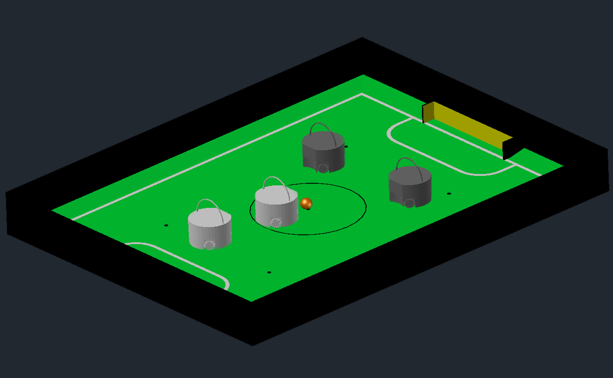
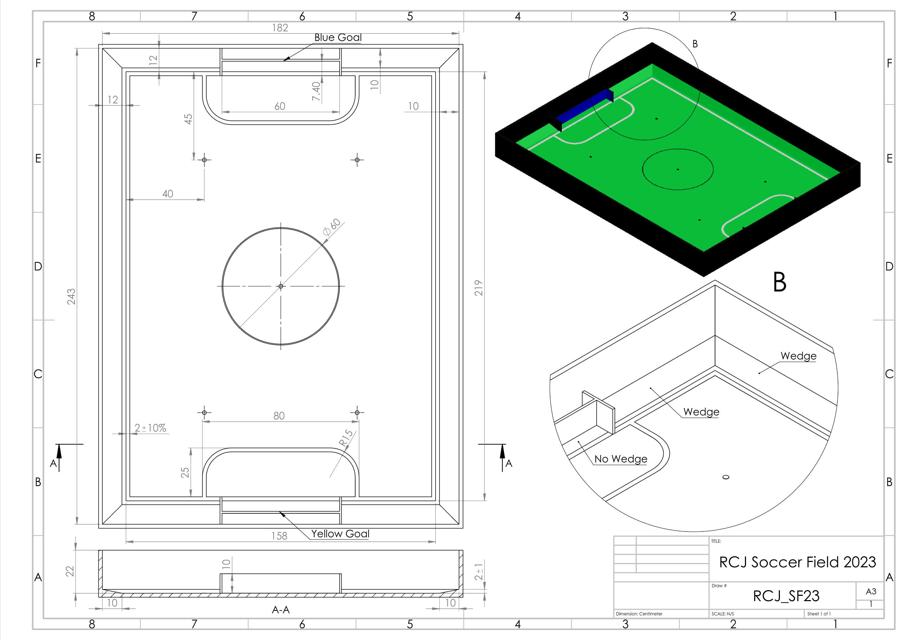

= RoboCupJunior Soccer Rules 2024
{docdate}
:toc: left
:sectanchors:
:sectlinks:
:xrefstyle: full
:section-refsig: Rule
:sectnums:

ifdef::basebackend-html[]
++++
<link rel="stylesheet" href="https://use.fontawesome.com/releases/v5.3.1/css/all.css" integrity="sha384-mzrmE5qonljUremFsqc01SB46JvROS7bZs3IO2EmfFsd15uHvIt+Y8vEf7N7fWAU" crossorigin="anonymous">

++++
endif::basebackend-html[]

:icons: font
:numbered:

//TODO: revert to official Soccer rules for final release
Estas são as regras oficiais  da categoria RoboCupJunior Soccer. Elas são divulgadas pelo Comitê da RoboCupJunior Soccer League. A versão em inglês dessas regras tem prioridade sobre qualquer tradução.
Esta versão é português é uma tradução e adaptação da regra oficial.

As equipes são aconselhadas a verificar o site RoboCupJunior Soccer
https://junior.forum.robocup.org/ para obter os procedimentos e requisitos para a competição internacional e com os organizadores de torneios locais para competições locais, regionais e super-regionais. Cada equipe é responsável por verificar a versão mais recente das regras antes da competição. Equipes devem solicitar esclarecimentos no Fórum sempre que necessário.
footnote:[A versão atual dessas regras pode ser encontrada em https://robocupjuniortc.github.io/soccer-rules/master/rules.html em formato HTML e em https://robocupjuniortc.github.io/soccer-rules/master/rules.pdf in PDF
form.]

[title="Duas equipes de dois robôs com uma bola laranja em um campo de futebol RoboCupJunior."]

[discrete]
== Prefácio

No desafio RoboCupJunior Soccer, equipes de jovens engenheiros projetam, constroem e programam dois robôs móveis totalmente autônomos para competir contra outro time em partidas. Os robôs devem detectar uma bola e marcar em um gol codificado por cores em um campo especial que se assemelha a um campo de futebol humano.

Para ter sucesso, os participantes devem demonstrar habilidade em programação, robótica, eletrônica e mecatrônica. Espera-se também que as equipes contribuam para o avanço da comunidade como um todo, compartilhando suas descobertas com outros participantes e praticando o bom espírito esportivo, independentemente da cultura, idade ou resultado da competição. *Espera-se que todos compitam, aprendam, se divirtam e cresçam.*

A RoboCupJunior Soccer consiste em duas sub-ligas: *Soccer Open* e *Soccer Lightweight*. Estas regras aplicam-se a ambas as sub-ligas. Existem duas diferenças principais entre as duas ligas.

* O *Soccer Lightweight* é jogado com uma bola especial que emite uma bola de sinal IR. Os robôs podem pesar até {~~1.1~>1.4~~} kg, podem ter uma zona de captura de bola de até 3,0 cm {-- e podem usar baterias de até 12,0 V de tensão nominal--}.

* O *Soccer Open* é jogado com uma bola laranja passiva de cores vivas. Os robôs podem pesar até 2,2 kg, podem ter uma zona de captura de bola de até 1,5 cm {--e podem usar baterias de até 15,0 V de tensão nominal--}.

Consulte <<ball>> para especificações da bola e <<league-regulations>> para obter mais detalhes sobre especificações/regulamentos.

_Se você gostaria de começar com o RoboCupJunior Soccer, entre em contato com o organizador de sua competição regional RoboCupJunior e pergunte sobre a_ <<entry-league>>.

A menos que especificado de outra forma, todas as partes destas regras são liberadas sob os termos da Licença Creative Commons Attribution-ShareAlike.

[discrete]
=== Mudanças nas regras de futebol da RoboCupJunior 2022

As mudanças nas regras desenvolvidas pelo Comitê da Liga de Futebol em cooperação com a comunidade RoboCup Junior Soccer (por favor, continue a postar ideias para o futuro no fórum a qualquer momento) visam melhorar a jogabilidade geral reduzindo a falta de progresso e situações fora de alcance (aumento do jogo tamanho da área) e para o Soccer Open, facilitando os requisitos de ótica e permitindo mais força de chute.

Alterações detalhadas estão listadas abaixo e vinculadas ao local correspondente na regra.

{+-~TOC-CHANGES~-+}

[discrete]
=== Construção e Programação devem ser realizadas exclusivamente pelos alunos

Os robôs devem ser construídos e programados exclusivamente por alunos membros da equipe. Mentores, professores, pais ou empresas não devem estar envolvidos no projeto, construção, montagem, programação ou depuração de robôs. Para evitar possíveis desqualificações, é extremamente importante que as equipes cumpram a <<league-regulations>>, especialmente <<regulations-construction>>
e <<regulations-programming>>, e todas as demais regras do competidor.

Em caso de dúvida, consulte o seu Representante Regional antes de inscrever a sua equipe.

[[gameplay]]
== Jogabilidade

[[game-procedure-and-length-of-a-game]]
=== Procedimento de jogo e duração de um jogo

Os jogos RCJ Soccer consistem em dois times de robôs jogando futebol um contra o outro. Cada equipe tem dois robôs autônomos. O jogo será composto por dois tempos. A duração de cada metade é de 10 minutos. Haverá um intervalo de 5 minutos entre os tempos.

O cronômetro do jogo funcionará durante os tempos sem parar (exceto quando um árbitro quiser consultar outro oficial). O cronômetro de jogo será executado por um árbitro ou assistente de árbitro (consulte <<referee-and-referee-assistant>>
para obter mais informações sobre suas funções).

Espera-se que as equipes estejam em campo 5 minutos antes do início do jogo. Estar na mesa de inspeção não conta a favor deste limite de tempo. As equipes que se atrasarem para o início do jogo podem ser penalizadas em um gol a cada *30 segundos*, a critério do árbitro.

O placar final do jogo será reduzido para que haja no máximo 10 gols de diferença entre o time perdedor e o time vencedor.

[[pre-match-meeting]]
=== Reunião pré-jogo

No início da primeira metade do jogo, um árbitro lançará uma moeda. O vencedor do sorteio pode escolher para qual ponta chutar ou chutar primeiro. O perdedor do sorteio escolhe a outra opção. Após o primeiro tempo, os times trocam de lado. A equipe que não deu o pontapé inicial no primeiro tempo do jogo dará o pontapé inicial para iniciar o segundo tempo do jogo.

Durante a reunião pré-jogo, o árbitro ou seu assistente podem verificar se os robôs são capazes de jogar (ou seja, se eles são pelo menos capazes de seguir e reagir à bola). Se nenhum dos robôs for capaz de jogar, o jogo não será jogado e zero gols serão concedidos a ambas as equipes.

[[kick-off]]
=== Começo

Cada metade do jogo começa com um pontapé de saída. Todos os robôs devem estar localizados em seu próprio lado do campo. Todos os robôs devem ser parados. A bola é posicionada por um árbitro no centro do campo.

A equipe que dá o pontapé inicial coloca seus robôs no campo primeiro.

A equipe que não deu o pontapé inicial agora colocará seus robôs no lado defensivo do campo. Todos os robôs da equipe que não estão dando o pontapé inicial devem estar a pelo menos 30 cm de distância da bola (fora do círculo central).

Os robôs não podem ser colocados fora dos limites. Os robôs não podem ser reposicionados depois de colocados, exceto se o árbitro solicitar um ajuste de posicionamento para garantir que os robôs sejam colocados corretamente nas posições de campo.

Ao comando do árbitro (geralmente por apito), todos os robôs serão iniciados imediatamente por cada capitão. Quaisquer robôs iniciados antecipadamente serão removidos do campo pelo árbitro e considerados danificados.

Antes do pontapé inicial, todos os robôs danificados ou fora dos limites podem retornar ao campo de jogo imediatamente se estiverem prontos e _totalmente funcionais_.

Se nenhum robô estiver presente em um pontapé inicial (porque eles saíram dos limites da <<out-of-bounds>> ou foram danificados <<damaged-robots>>), tas penalidades são descartadas e a partida recomeça com uma <<neutral-kickoff>>.

[[neutral-kickoff]]
==== Saída de ponto neutro

Um pontapé inicial neutro é o mesmo descrito na <<kick-off>> com uma pequena alteração: todos os robôs devem estar a pelo menos 30 cm de distância da bola (fora do círculo central).

[[human-interference]]
=== Interferência humana
Exceto para o pontapé inicial, a interferência humana das equipes (por exemplo, tocar os robôs) durante o jogo não é permitida, a menos que explicitamente permitida por um árbitro. A(s) equipe(s)/membro(s) da equipe infratores podem ser desqualificados do jogo.

O árbitro ou um assistente de árbitro pode ajudar os robôs a se soltarem se a bola não estiver sendo disputada perto deles e se a situação for criada a partir da interação normal entre os robôs (ou seja, não foi uma falha de projeto ou programação do robô sozinho). O árbitro ou um assistente de árbitro puxará os robôs para trás apenas o suficiente para que eles possam se mover livremente novamente.

[[ball-movement]]
=== Movimento da bola

Um robô não pode segurar uma bola. Segurar uma bola é definido como assumir o controle total da bola removendo todos os graus de liberdade. Exemplos de segurar a bola incluem fixar uma bola no corpo do robô, cercar uma bola usando o corpo do robô para impedir o acesso de outros, cercar a bola ou prender a bola de alguma forma com qualquer parte do corpo do robô. Se uma bola não rolar enquanto um robô estiver se movendo, é uma boa indicação de que a bola está presa.

A única exceção para segurar é o uso de um tambor giratório (um "driblador") que confere um giro dinâmico para trás na bola para mantê-la em sua superfície.

Outros jogadores devem ter acesso à bola.

A bola precisa ficar dentro dos limites do campo, conforme definido pelas paredes. Se um robô mover a bola para fora do campo (ou seja, além das paredes ou acima de sua altura), ela será considerada danificada. (<<damaged-robots>>)

{~~Um robô deve tocar a bola colocada a não mais que 20 cm de qualquer ponto de sua area convexa dentro de 10 segundos. Se um robô não realizar aação dentro do prazo, será considerado danificado.
~>Qualquer robô deve se aproximar e tocar a bola quando ela for colocada no ponto neutro mais próximo. Deve fazer isso antes que a falta de progresso seja sinalizada. Quando estiver em seu próprio lado do campo, qualquer robô deve ser capaz de mover a bola do ponto neutro mais próximo para o lado do campo adversário. Se um robô específico não agir desta forma, os árbitros poderão considerá-lo danificado a seu critério.
(Veja <<damaged-robots, Damaged Robots>>.) Esta regra não se aplica se o robô for impedido de detectar ou jogar a bola pelo oponente.~~}

[[scoring]]
=== Pontuação

Um gol é marcado quando a bola atinge ou toca a parede do fundo do gol. Os gols marcados por qualquer robô têm o mesmo resultado final: dão um gol para o time do lado oposto. Depois de um gol, o jogo será reiniciado com um pontapé de saída da equipe contra a qual foi marcado.

[[inside-penalty-area]]
=== Dentro da área de pênalti

Nenhum robô pode estar totalmente dentro da área de penalidade. Como as áreas de penalidade são marcadas com uma linha branca, as regras Fora dos Limites e Fora do Alcance também se aplicam.(<<out-of-bounds>>)

Se dois robôs da mesma equipe estiverem pelo menos parcialmente em uma área de penalidade, o robô mais distante da bola será movido para o _ponto neutro desocupado mais distante_ imediatamente. Se isso acontecer repetidamente, um robô pode ser considerado danificado a critério do árbitro. (<<damaged-robots>>)

Se um robô atacante e um defensor se tocarem enquanto pelo menos um deles estiver pelo menos parcialmente dentro da área de penalidade, e pelo menos um deles tiver contato físico com a bola, isso pode ser chamado de "empurrão" a critério do árbitro. Neste caso, a bola será movida para o _ponto neutro desocupado_ mais distante imediatamente.

Se um gol for marcado como resultado de uma situação de "empurrão", ele não será concedido.

[[lack-of-progress]]
=== Falta de progresso

A falta de progresso ocorre se não houver progresso no jogo por um período de tempo razoável e a situação provavelmente não mudará. Situações típicas de falta de progresso são quando a bola está presa entre os robôs, quando não há mudança nas posições da bola e do robô, ou quando a bola está além da detecção ou capacidade de alcance de todos os robôs no campo.

Após uma contagem visível e alta footnote:[geralmente uma contagem de três],
um árbitro informará `*falta de pregresso*` e moverá a bola para o ponto neutro desocupado mais próximo. Se isso não resolver a falta de progresso, o árbitro pode mover a bola para um ponto neutro diferente.

[[out-of-bounds]]
=== Fora dos limites

Se um robô tocar uma parede ou se mover completamente para dentro da área de penalidade, ele será informando `*robô fora*`. Quando essa situação ocorre, o robô recebe uma penalidade de um minuto e a equipe é solicitada a remover o robô do campo. Não há interrupção do tempo para o jogo em si. O robô pode retornar se um pontapé de saída ocorrer antes que a penalidade tenha decorrido.

A penalidade de um minuto começa quando o robô é removido do jogo. Além disso, qualquer gol marcado pela equipe penalizada enquanto o robô penalizado estiver em campo não será concedido. Os robôs fora dos limites podem ser consertados se a equipe precisar, conforme descrito na <<damaged-robots>>.

After the penalty time has passed, robot will be placed on the unoccupied
neutral spot furthest from the ball, facing its own goal.

Um árbitro pode dispensar a penalidade se o robô for acidentalmente empurrado para fora de campo por um robô adversário. Nesse caso, o árbitro pode ter que empurrar levemente o robô de volta ao campo.

A bola pode sair e voltar para o campo de jogo. O árbitro chama
`*fora de alcance*`, e moverá a bola para o ponto neutro desocupado mais próximo quando ocorrer uma das seguintes condições:

1. a bola permanece fora do campo de jogo por muito tempo, após uma contagem visível e alta footnote:[geralmente uma contagem de três],

2. algum dos robôs não conseguir devolvê-lo ao campo de jogo (sem que todo o corpo saia do campo de jogo) ou

3. o árbitro determina que a bola não voltará para o campo de jogo.

[[damaged-robots]]
=== Robôs danificados

Se um robô for danificado, ele deve ser retirado do campo e deve ser consertado antes que possa jogar novamente. Mesmo consertado, o robô deve permanecer fora de campo por pelo menos um minuto ou até o próximo pontapé inicial.

Alguns exemplos de um robô danificado incluem:

* não responde à bola, ou não consegue se mover (perdeu peças, força, etc.).
* ele se move continuamente para dentro da área de penalidade ou para fora dos limites.
* ele gira por conta própria.

Computadores e equipamentos de reparo não são permitidos na área de jogo durante o jogo. Normalmente, um membro da equipe precisará levar o robô danificado para uma "mesa de reparo aprovada" perto da área de jogo. Um árbitro pode permitir a calibração do sensor do robô, computadores e outras ferramentas na área de jogo, apenas 5 minutos antes do início de cada tempo.

Depois que um robô for consertado, ele será colocado no ponto neutro desocupado mais distante da bola, de frente para seu próprio gol. Um robô só pode ser devolvido ao campo se o dano tiver sido reparado. Se o árbitro perceber que o robô voltou ao campo com o mesmo problema original, poderá solicitar a retirada do robô e prosseguir com o jogo como se o robô não tivesse retornado..

*Somente o árbitro decide se um robô está danificado* Um robô só pode ser retirado ou devolvido com a permissão do árbitro.

Se ambos os robôs da mesma equipe forem considerados danificados no início do jogo, o jogo será pausado e o time restante receberá 1 gol para cada 30 segundos decorridos em que os robôs do oponente permanecerem danificados. No entanto, essas regras só se aplicam quando nenhum dos dois robôs da mesma equipe foi danificado como resultado da violação das regras pela equipe adversária.

Sempre que um robô é retirado do jogo, seus motores devem ser desligados.

[[interruption-of-game-ref-interruption]]
=== Interrupção do jogo

Em princípio, um jogo não será interrompido.

Um árbitro pode parar o jogo se houver uma situação dentro ou ao redor do campo que o árbitro queira discutir com um oficial do torneio ou se a bola apresentar defeito e uma substituição não estiver prontamente disponível.

Quando o árbitro interrompe o jogo, todos os robôs devem ser parados e permanecer intocados no campo. O árbitro pode decidir se o jogo será continuado/reiniciado a partir da situação em que o jogo foi interrompido ou por uma nova saída de jogo.

[[team]]
== EQUIPE

[[team-regulations]]
=== Regulamentos

Uma equipe deve ter mais de um membro para formar uma equipe RoboCupJunior para participar da competição internacional. O(s) membro(s) da equipe e/ou robô(s) não podem ser compartilhados entre as equipes.

Cada membro da equipe precisa desempenhar um papel técnico.

Cada equipe deve ter um *capitão*. O capitão é a pessoa responsável pela comunicação com os árbitros. A equipe pode substituir seu capitão por outro membro da equipe durante a competição. Cada equipe pode ter no máximo dois membros ao lado do campo durante o jogo: eles geralmente serão o capitão e um membro assistente da equipe.

[[team-violations]]
=== Violações

As equipes que não cumprirem as regras não poderão participar.

Espera-se que os robôs sejam capazes de lidar com qualquer cor acima das paredes (por exemplo, camisas azuis, amarelas, verdes ou laranja) seja em hardware (por exemplo, limitando o campo de visão de olhar para cima) ou em software (por exemplo, mascarando a imagem de entrada).

O árbitro pode interromper um jogo em andamento se houver suspeita de qualquer tipo de interferência dos espectadores (emissores infravermelhos, flashes de câmeras, celulares, rádios, computadores, etc.).

Isso precisa ser confirmado pelos organizadores do torneio se uma reclamação for feita pela outra equipe. Uma equipe que alegue que seu robô é afetado por cores deve mostrar a prova/evidência da interferência.

[[robots]]
== ROBÔS

[[number-of-robots-substitution]]
=== Número de robôs / substituições

Cada equipe pode ter no máximo dois robôs para o torneio completo. É proibida a substituição de robôs durante a competição dentro da equipe ou com outras equipes.

[[robots-interference]]
===  Interferência

Os robôs não podem ser coloridos de laranja, amarelo ou azul para evitar interferências. As peças de cor laranja, amarelo e azul usadas na construção do robô devem ser ocultadas por outras partes da percepção de outros robôs ou ser coladas/pintadas com uma cor neutra.

Os robôs não devem produzir interferência magnética em outros robôs no campo.

Os robôs não devem produzir luz visível que possa impedir a equipe adversária de jogar quando colocados em uma superfície plana. Qualquer parte de um robô que produza luz que possa interferir no sistema de visão do robô oponente deve ser coberta. Para regulamentos específicos de peso leve, consulte
Para a categoria Lightweight, consulte  <<regulations-inference-in-lightweight>>

Uma equipe que alegue que seu robô é afetado de alguma forma pelo robô da outra equipe deve mostrar a prova/evidência da interferência. Qualquer interferência precisa ser confirmada pelos organizadores do torneio se uma reclamação for feita pela outra equipe.

[[robots-control]]
=== Controle

Não é permitido o uso de controle remoto de qualquer tipo durante a partida. Os robôs devem ser iniciados e parados manualmente por humanos e controlados de forma autônoma.

[[communication]]
=== Comunicação

Os robôs não podem usar nenhum tipo de comunicação durante o jogo, a menos que a comunicação entre os robôs seja via Bluetooth classe 2 ou classe 3
footnote:[alcance inferior a 20 metros] ou qualquer outro dispositivo que se comunique usando o protocolo 802.15.4 (por exemplo, ZigBee e XBee).

As equipes são responsáveis por sua comunicação. A disponibilidade de frequências não pode ser garantida.

[[agility]]
=== Agilidade

Os robôs devem ser construídos e programados de forma que seu movimento não seja limitado a apenas uma dimensão (definida como um único eixo, como mover-se apenas em linha reta). Eles devem se mover em todas as direções, por exemplo, girando.

Os robôs devem responder à bola em um movimento direto para frente em direção a ela. Por exemplo, não basta basicamente apenas se mover para a esquerda e para a direita na frente do próprio gol, é preciso também se mover diretamente em direção à bola em um movimento para frente. Pelo menos um robô da equipe deve ser capaz de buscar e se aproximar da bola em qualquer lugar do campo, a menos que a equipe tenha apenas um robô no campo naquele momento.

Um robô deve tocar a bola colocada a não mais de 20 cm de qualquer ponto de seu casco convexo em 10 segundos. Se um robô não o fizer dentro do prazo, ele será considerado danificado. (Consulte <<damaged-robots, Damaged Robots>>.)

[[handle]]
=== Alça

Todos os robôs devem ter uma alça estável e facilmente perceptível para segurá-los e levantá-los. A alça deve ser facilmente acessível e permitir que o robô seja levantado pelo menos 5 cm acima da estrutura mais alta do robô.

As dimensões da alça podem exceder a limitação de altura do robô, mas a parte da alça que excede esse limite não pode ser usada para montar componentes do robô.

[[top-markers]]
=== Marcadores

Um robô deve ter marcações para ser distinguido pelo árbitro. Cada robô deve ter um círculo de plástico branco com um diâmetro de pelo menos 4 cm montado horizontalmente no topo. Este círculo branco será usado pelo árbitro para escrever números nos robôs usando marcadores, portanto os círculos brancos devem estar acessíveis e visíveis.

Antes do jogo, o árbitro designará os números para cada robô e os escreverá no círculo branco superior. Os robôs que não carregam o círculo branco superior não são elegíveis para jogar.

.Uma visualização do marcador na parte superior superior
image::media/image4.jpeg[scaledwidth=50.0%]

[[additional-regulations-of-the-sub-leagues]]
=== Regulamentos adicionais das sub-ligas

Um torneio pode ser organizado em diferentes sub-ligas. Cada sub-liga (por exemplo, *Soccer Open* e *Soccer Lightweight*) tem seus próprios regulamentos adicionais, incluindo regulamentos que afetam a construção de robôs. Eles estão descritos na <<league-regulations>>.

[[violations]]
=== Violações

Os robôs que não cumprem as especificações/regulamentos (ver
<<regulations>>) não podem jogar, a menos que estas regras especifiquem o contrário.

Se forem detectadas violações durante um jogo em andamento, a equipe pode ser desclassificada desse jogo.

Se violações semelhantes ocorrerem repetidamente, a equipe pode ser desqualificada do torneio.

[[field]]
== CAMPO

[[dimensions-of-the-field]]
=== Dimensões do campo

O tamanho do campo de jogo é {~~132 cm por 193 cm~>158 cm por 219 cm~~}. O campo é marcado por uma linha branca que faz parte do campo de jogo. Ao redor do campo de jogo, além da linha branca, há uma área externa de {~~25 cm de largura~>12 cm de largura~~}.

O piso próximo à parede externa inclui uma cunha, que é uma inclinação com 10 cm de base e 2 +/- 1 cm de altura para permitir que a bola volte ao jogo quando ela sai do campo de jogo.

As dimensões totais do campo, incluindo a área externa, são de 182 cm por 243 cm.

[[field-walls]]
=== Paredes

As paredes são colocadas em todo o campo, inclusive atrás dos gols e na área externa. A altura das paredes é de 22 cm. As paredes são pintadas de preto fosco.

[[goals]]
=== Gols

O campo tem dois gols, centrados em cada um dos lados mais curtos do campo de jogo. O espaço interior da baliza tem 60 cm de largura, 10 cm de altura e 74 mm de profundidade, em forma de caixa.

Os "postes" da baliza estão posicionados sobre a linha branca que marca os limites do campo.

As paredes interiores e de cada baliza são de cor mate, uma baliza amarela e a outra baliza azul. Recomenda-se que o azul seja de um tom mais claro para que seja diferente o suficiente do exterior preto.

[[floor]]
=== Piso

O piso é composto por carpete verde idealmente de tom mais escuro sobre uma superfície dura e nivelada. As equipes devem estar preparadas para se ajustar a diferentes níveis de contraste entre o tapete verde e as linhas, pois alguns eventos podem ser restritos ao uso de tons mais claros de verde. Todas as linhas no campo devem ser pintadas, marcadas com fita adesiva ou instaladas como carpete branco e ser um pouco resistente a rasgar ou rasgar.As linhas devem ter uma largura de 20 mm (±10%).

É impraticável definir restrições internacionais para carpetes além de ser verde. No espírito da competição, as equipes devem projetar robôs para serem tolerantes ou adaptáveis ​​a diferentes fibras, texturas, construção, densidade, tons e desenhos de tapetes, especialmente quando competindo entre diferentes regiões. As equipes são encorajadas a visitar os recursos regionais ou entrar em contato com o Comitê de Organização Local para obter sugestões se desejarem construir seu(s) próprio(s) campo(s) de prática.

[[neutral-spots]]
=== Pontos Neutros

Existem cinco pontos neutros definidos no campo. Um está no centro do campo. Os outros quatro são adjacentes a cada canto , localizado a 45 cm ao longo da borda longa do campo. Eles se alinham com os lados das áreas de penalidade. Os pontos neutros podem ser desenhados com um marcador preto fino. Os pontos neutros devem ter forma circular medindo 1 cm de diâmetro.

[[center-circle]]
=== Círculo central

Um círculo central será desenhado no campo. Tem 60 cm de diâmetro. É uma linha fina de marcador preto. Está disponível para os árbitros e capitães como orientação durante o pontapé de saída.

[[penalty-areas]]
=== Áreas de penalidade

Na frente de cada gol há uma área de pênalti de 25 cm de largura e {~~70 cm de comprimento~>80 cm de comprimento~~} com cantos frontais arredondados (raio de 15 cm).

As áreas de penalidade são marcadas por uma linha branca de 20 mm (±10%) de largura. A linha faz parte da área.

[[lighting-and-magnetic-conditions]]
=== Iluminação e Condições Magnéticas

Os organizadores do torneio farão o possível para limitar a quantidade de raios externos e interferência magnética. No entanto, os robôs precisam ser construídos de forma a permitir que trabalhem em condições que não são perfeitas (ou seja, não dependendo de sensores de bússola ou condições específicas de iluminação).

[discrete]
[[field-diagrams]]
== DIAGRAMAS DE CAMPO

image:media/SoccerFieldWedgeNoWedge.jpg[image,scaledwidth=90.0%]

[[ball]]
== BOLA

[[specification-for-soccer-lightweight-ball]]
=== Especificação para Bola da categoria Soccer Lightweight

Veja <<technical-specification-for-pulsed-soccer-ball>>.

[[specification-for-soccer-open-ball]]
=== Especificação para Bola da categoria Soccer Open

Veja <<passive-ball-spec>>.

[[tournament-balls]]
=== Bolas da Competição

As bolas para o torneio devem ser disponibilizadas pelos organizadores do torneio. Os organizadores do torneio não são responsáveis ​​por fornecer bolas para a prática.

[[code-of-conduct]]
== CÓDIGO DE CONDUTA

[[fair-play]]
=== Fair Play

Espera-se que o objetivo de todas as equipes seja jogar um jogo justo e limpo de futebol de robôs. Espera-se que todos os robôs sejam construídos levando em consideração os outros participantes.

Os robôs não podem causar interferência deliberada ou danos a outros robôs durante o jogo normal.

Os robôs não podem causar danos ao campo ou à bola durante o jogo normal.

Um robô que cause danos pode ser desclassificado de uma partida específica a critério do organizador do torneio.

Os humanos não estão autorizados a causar interferência deliberada nos robôs ou danificar o campo ou a bola.

[[behavior]]
=== Comportamento

Espera-se que todos os participantes se comportem. Todos os movimentos e comportamentos devem ser moderados dentro do local do torneio.

[[help]]
=== Ajuda

Mentores (professores, pais, acompanhantes e outros membros adultos da equipe, incluindo tradutores) não são permitidos na área de trabalho do aluno, a menos que seja explicitamente, mas temporariamente permitido pelos organizadores do torneio. Apenas os alunos participantes podem estar dentro da área de trabalho.

*Os mentores não devem tocar, construir, consertar ou programar nenhum robô.*

[[sharing]]
=== Compartilhamento

O entendimento de que quaisquer desenvolvimentos tecnológicos e curriculares devem ser compartilhados entre os participantes da RoboCup e RoboCupJunior após o torneio faz parte das competições mundiais da RoboCup.

[[spirit]]
=== Espirito de Competição

Espera-se que todos os participantes, alunos, mentores e pais respeitem a missão da RoboCupJunior.

*_Não é se você ganha ou perde, mas quanto você aprende que conta!_*

[[violations-disqualification]]
=== Violações / Desqualificação

As equipes que violarem o código de conduta poderão ser desclassificadas do torneio. Também é possível desqualificar apenas uma única pessoa ou um único robô da participação no torneio.

Em casos menos graves de violação do código de conduta, uma equipe será advertida. Em casos graves ou repetidos de violação do código de conduta, uma equipe pode ser desclassificada imediatamente sem aviso prévio.

[[conflict-resolution]]
== RESOLUÇÃO DE CONFLITOS

[[referee-and-referee-assistant]]
=== Árbitro e assistente de arbitragem

O árbitro é a pessoa encarregada de tomar as decisões referentes ao jogo, de acordo com estas regras, podendo ser auxiliado por um árbitro assistente.

*Durante o jogo, as decisões tomadas pelo árbitro e/ou assistente do árbitro são finais.*

Qualquer discussão com o árbitro ou o assistente do árbitro pode resultar em advertência. Se a discussão continuar ou ocorrer outra discussão, isso pode resultar na desqualificação imediata do jogo.

Apenas o capitão tem o mandato de falar livremente com o árbitro e/ou seu assistente. Gritar com um árbitro e/ou seu assistente, bem como exigir uma mudança na decisão pode ser penalizado com uma advertência a critério do árbitro.

Na conclusão do jogo, o resultado registrado na súmula é final. O árbitro pedirá aos capitães que acrescentem comentários escritos à súmula, se os considerarem necessários. Esses comentários serão analisados ​​pelos organizadores do torneio.

[[rule-clarification]]
=== Esclarecimento de regras

O esclarecimento das regras pode ser feito por membros dos organizadores do torneio e pelo Comitê da Liga de Futebol, se necessário, mesmo durante um torneio.

[[rule-modification]]
=== Modificação da regra

Se ocorrerem circunstâncias especiais, como problemas imprevistos ou capacidades de um robô, as regras podem ser modificadas pelos organizadores do torneio, se necessário, mesmo durante o torneio.

[[regulatory-statutes]]
=== Estatutos regulatórios

Cada competição RoboCupJunior pode ter os seus próprios estatutos regulamentares para definir o procedimento do torneio (por exemplo o sistema SuperTeam, modos de jogo, inspeção de robôs, entrevistas, horários, etc.). Estatutos regulatórios passam a fazer parte dessa regra.

[[league-regulations]]
== REGULAMENTO DA LIGA

[[league-regulations-preamble]]
=== Preâmbulo

De acordo com a regra 3.8 das Regras do Futebol RoboCupJunior, cada liga tem seus próprios regulamentos adicionais. Eles se tornam parte das regras.

Para a RoboCupJunior, existem duas sub-ligas da seguinte forma
footnote:[maiores diferenças são descritas na <<dimensions>>]:

* Soccer Lightweight
* Soccer Open

Todos os membros da equipe precisam estar dentro da faixa etária especificada nas Regras Gerais do RoboCupJunior, que podem ser encontradas em
http://junior.robocup.org/robocupjunior-general-rules/.

Conforme descrito na  <<specification-for-soccer-lightweight-ball>> e <<specification-for-soccer-open-ball>>,  as partidas na subliga Soccer Open são conduzidas usando uma bola passiva, enquanto as partidas na subliga Soccer Lightweight liga são jogados com a bola IR.

[[regulations]]
=== Regulamentos

[[dimensions]]
==== Dimensões

Os robôs serão medidos na posição vertical com todas as partes estendidas. As dimensões de um robô não devem exceder os seguintes limites:

|===
|sub-lega *Soccer*| *Open* | *Soccer Lightweight*
|tamanho ^[0]^  | 18.0 cm | 22.0 cm +
|altura | 18.0 cm ^[1]^ | 22.0 cm ^[1]^ +
|peso | 2200 g ^[2]^ | 1100 g ^[2]^ +
|zona de captura de bola | 1.5 cm | 3.0 cm +
|tensão | {~~15.0 V~>48V DC / 25V AC RMS~~} ^[3]^ ^[4]^ | {~~12.0 V~>48V DC / 25V AC RMS~~} ^[3]^ ^[4]^ +
|===

TIP: [0] O robô deve caber suavemente em um cilindro deste diâmetro

TIP: [1] A alça e os marcadores superiores de um robô podem exceder a altura.

TIP: [2] O peso do robô inclui o da alça.

IMPORTANT: [3] Encorajamos *fortemente* as equipes a incluir circuitos de proteção para baterias à base de lítio

NOTE: [4] {~Os limites de tensão referem-se aos *valores nominais*, serão tolerados desvios na fonte de alimentação devido ao fato de estar carregado~>O limite de tensão refere-se à tensão máxima em qualquer ponto e a qualquer momento no robô, *não às tensões nominais*.~~}

A zona de captura de bola é definida como qualquer espaço interno criado quando uma aresta reta é colocada nos pontos salientes de um robô. Isso significa que a bola não deve entrar no casco convexo de um robô além da profundidade especificada. Além disso, deve ser possível que outro robô tome posse da bola.

[[regulations-inference-in-lightweight]]
====  Interferência infravermelha na categoria Lightweight

Componentes projetados para emitir IR (por exemplo, ToF, LiDAR, sensores de distância IR, LEDs IR/LASERs etc.) não são permitidos e os organizadores do torneio exigirão que tais dispositivos sejam removido ou coberto.

Em Lightweight, os materiais que refletem a luz infravermelha não devem ser visíveis. Se os robôs forem pintados, eles devem ser foscos. Peças menores que refletem a luz infravermelha podem ser usadas, desde que outros robôs não sejam afetados.

[[regulations-limitations]]
==== Limitações

Um robô pode usar qualquer número de câmeras sem restrições de lentes, peças óticas, sistemas óticos e campo de visão total. Os componentes podem ser adquiridos de qualquer maneira que a equipe achar adequada.

Os circuitos da bomba de tensão são permitidos apenas para uma unidade de kicker. Nenhuma tensão pode exceder 48 V em nenhum momento e a tensão de reforço máxima deve estar disponível para demonstração e medição nas inspeções. Quando não estiver em uso, os contatos de medição devem ser protegidos contra toques acidentais ou curtos-circuitos.Todos os outros circuitos elétricos dentro do robô não podem exceder 15,0 V para Soccer Open e 12,0 V para Soccer Lightweight. Cada robô deve ser projetado para permitir a verificação da tensão das fontes de alimentação e seus circuitos, a menos que a tensão nominal seja óbvia ao olhar para o robô, suas fontes de alimentação e conexões.

Dispositivos pneumáticos podem usar apenas ar ambiente.

A força do kicker está sujeita a verificação de conformidade a qualquer momento durante a competição. Durante o jogo, um árbitro pode pedir para ver um chute de amostra no campo antes de cada tempo, quando um robô danificado é devolvido ao campo ou quando o jogo está prestes a ser reiniciado após um gol. Se o árbitro suspeitar fortemente que um chutador excedeu o limite de potência, ele pode exigir uma medição oficial. Consulte <<kicker-power-measuring>> para obter mais detalhes.

[[regulations-construction]]
==== Construção

IMPORTANT: Os robôs devem ser construídos exclusivamente pelos alunos membros de uma equipe. Mentores, professores, pais ou empresas não podem estar envolvidos no projeto, construção e montagem de robôs.

Para a construção de um robô, qualquer kit de robô ou bloco de construção pode ser usado, desde que o projeto e a construção sejam principalmente e substancialmente o trabalho original de uma equipe. Isso significa que kits comerciais podem ser usados, mas devem ser substancialmente modificados pela equipe. Não é permitido seguir principalmente um manual de construção, nem apenas trocar peças sem importância.

Indicações para violações são o uso de kits comerciais que basicamente só podem ser montados de uma maneira ou o fato de que robôs de equipes diferentes, construídos a partir do mesmo kit comercial, todos basicamente parecem ou funcionam da mesma forma.

Os robôs devem ser construídos de forma que possam ser iniciados pelo capitão sem a ajuda de outra pessoa.

Como não é possível prever totalmente um contato com um robô adversário e/ou driblador que possa danificar algumas partes dos robôs, *os robôs devem ter todos os seus elementos ativos devidamente protegidos com materiais resistentes.* Por exemplo, circuitos elétricos e dispositivos pneumáticos, como tubulações e garrafas, devem ser protegidos de todo contato humano e contato direto com outros robôs.

IMPORTANT: Todas as engrenagens do driblador acionado devem ser cobertas com metal ou plástico rígido.

Quando as baterias são transportadas ou movidas, é *altamente* recomendável o uso de bolsas de segurança. Devem ser feitos esforços razoáveis ​​para garantir que, em todas as circunstâncias, os robôs evitem curtos-circuitos e vazamentos de produtos químicos ou de ar.

IMPORTANT: Não é permitido o uso de bateria inchada, esfarrapada ou perigosa.

[[regulations-programming]]
==== Programação

Os robôs devem ser programados exclusivamente por alunos membros da equipe. Mentores, professores, pais ou empresas não devem estar envolvidos na programação e depuração de robôs.

Para a programação dos robôs, pode ser utilizada qualquer linguagem de programação, interface ou ambiente de desenvolvimento integrado (IDE). Não é permitido o uso de programas que vêm junto com um kit comercial (especialmente programas de amostra ou presets) ou partes substanciais de tais programas. Não é permitido usar programas de exemplo, mesmo que sejam modificados.

[[regulations-inspections]]
==== Inspeções

Os robôs devem ser inspecionados e certificados todos os dias antes do primeiro jogo. Os organizadores do torneio podem solicitar outras inspeções se necessário, incluindo inspeções aleatórias que podem acontecer a qualquer momento. As inspeções de rotina incluem:

* Restrições de peso para a subliga específica (consulte <<dimensions>>).
* Dimensões do robô (consulte <<dimensions>>).
* Restrições de tensão (ver <<dimensions>> and <<regulations-limitations>>).
* Limites de força do kicker, se o robô tiver um kicker (consulte <<kicker-power-measuring>>).

A prova deve ser fornecida por cada equipe de que seus robôs cumprem estes regulamentos, por exemplo, por meio de uma documentação detalhada ou diário de bordo. As equipes podem ser entrevistadas sobre seus robôs e o processo de desenvolvimento a qualquer momento durante o torneio.

[[international-competition]]
== COMPETIÇÃO INTERNACIONAL

[[international-competition-team]]
=== Equipe

O tamanho máximo da equipe é de 4 membros para o RoboCupJunior Soccer.

Os membros da equipe de futebol leve podem participar do Campeonato Mundial apenas duas vezes. Após a segunda participação, eles precisam passar para o Soccer Open.

[[interviews]]
=== Entrevistas

Durante a competição internacional, os organizadores do torneio agendarão entrevistas com as equipes durante o dia de preparação do evento. Isso significa que as equipes precisam estar presentes já cedo neste dia. As equipes devem trazer os robôs, o código usado para programá-los e qualquer documentação para a entrevista.

Durante uma entrevista, pelo menos um membro de cada equipe deve ser capaz de explicar particularidades sobre os robôs da equipe, principalmente no que diz respeito à sua construção e programação. Um entrevistador pode pedir uma demonstração à equipe. O entrevistador também pode pedir à equipe para escrever um programa simples durante a entrevista para verificar se a equipe é capaz de programar seu robô.

Espera-se que todas as equipes sejam capazes de conduzir a entrevista em inglês. Se isso representar um problema, a equipe pode solicitar a presença de um tradutor na entrevista. Se os organizadores do torneio não puderem fornecer um tradutor, a equipe deverá fazê-lo. Durante a entrevista, a equipe será avaliada por meio das chamadas Rubricas, que são publicadas no site mencionado no início deste regulamento.

O Comitê da Liga de Futebol recomenda a realização de entrevistas também nas competições regionais, mas isso não é obrigatório.

[[technical-challenges]]
=== Desafio Técnicos

Inspirado pelas ligas principais e pela necessidade de maior avanço tecnológico das ligas, o Comitê da Liga de Futebol decidiu introduzir os chamados *Desafios Técnicos.*

A ideia desses desafios é dar às equipes a oportunidade de mostrar várias habilidades de seus robôs que podem não ser notadas durante os jogos regulares. Além disso, o Comitê da Liga de Futebol prevê que esses desafios sejam um local para testar novas ideias que possam fazer parte das regras futuras ou moldar a competição.

Qualquer equipe da RoboCupJunior Soccer poderá tentar enfrentar esses desafios. Salvo indicação em contrário, qualquer robô que participe desses desafios precisa obedecer a essas regras para concluí-lo com sucesso.

[[precision-shooter]]
==== Chute de Precisão

_Os resultados no futebol são avaliados pelo número de gols marcados. A história geralmente não se importa como eles foram marcados. Para os espectadores, porém, isso costuma fazer toda a diferença._

Este desafio consiste em seis rodadas. Em cada rodada, o robô parte de sua própria área de pênalti voltada para o gol. A bola é colocada aleatoriamente (rolando um dado) dentro desta metade do campo em um dos seguintes pontos:

1. Ponto neutro esquerdo
2. Ponto neutro direito
3. Canto esquerdo da grande área
4. Canto direito da grande área
5. Canto esquerdo do campo
6. Canto direito do campo

O robô precisa localizar a bola e marcar um gol enquanto permanece em sua própria metade do campo. Cada rodada leva no máximo 20 segundos.

* A equipe é livre para escolher de que lado chutar.
* O mesmo robô deve ser usado em todas as rodadas.
* O robô deve permanecer em sua metade do campo para que o gol seja válido, mas as regras de "fora dos limites" não se aplicam.

[[goal_parts]]
.Metas divididas em 6 partes.
image::media/goal_parts.png[align="center"]

Inicialmente, a baliza oposta está completamente aberta (ver <<goal_parts>>). Após cada golo marcado, um membro da equipa lança um dado e a parte do golo que corresponder ao número do dado será coberta com uma caixa preta. Se esta parte do objetivo já estiver coberta, o dado será lançado novamente. Consulte <<goal_parts_filled>>, onde o número 3 e o número 5 foram lançados em um dado após cada rodada e as respectivas partes do gol são cobertas. Observe que, se o número 3 ou 5 for lançado nas próximas rodadas, um novo lançamento de dados ocorrerá.

O resultado deste desafio é o número de golos marcados.

[[goal_parts_filled]]
.Um exemplo de estado dasmetas após duas rodadas
image::media/goal_parts_filled.png[align="center"]

[[penalty-kick]]
==== Cobrança de Penâlti

No futebol, um pênalti ocorre após uma infração grave acontecer. O objetivo deste desafio técnico é ver se algo semelhante pode ser feito dentro dos limites do RoboCupJunior Soccer.

O procedimento de chute consiste nas seguintes etapas:

1. Todos os robôs, assim como a bola, são removidos do campo.
2. A equipe infratora ("chutando") coloca um robô dentro de sua própria área de pênalti, girando em direção ao seu próprio gol. Uma bola é colocada no ponto neutro central.
3. A equipe ofensiva ("chutando") liga seu robô. O robô precisa ficar parado pelos próximos 5 segundos.
4. Durante esses 5 segundos a equipe defensora coloca um robô que é desligado dentro de sua própria área de penalidade.
5. Para marcar um gol, o robô do time infrator precisa mover a bola para dentro do gol adversário. Ele precisa fazer isso em no máximo 15 segundos e permanecendo dentro do círculo central assim que tocar na bola.

Se o robô da equipe infratora se mover antes de passarem os 5 segundos, o resultado será automaticamente nenhum gol. Terminada a cobrança de pênalti, o jogo continua com a <<kick-off>>, com o time defensor dando o pontapé inicial.

[[vertical-kick]]
==== Chute vertical

A introdução de uma bola de golfe laranja no Open deve abrir novas opções de jogo. Dado o menor tamanho e peso das bolas de golfe, deveria ser possível chutá-las não apenas horizontalmente (como em "2D"), mas também verticalmente (isto é, lançar a bola no ar).

A tarefa neste desafio técnico é marcar para o gol amarelo aberto da outra metade (azul) do campo. Para passar o desafio, a bola só pode tocar a outra metade (amarela) do campo dentro da grande área e o próprio gol. Observe que uma bola de golfe (não necessariamente laranja) precisa ser usada.

[[further-information-on-international-competition]]
=== Mais informações sobre Competição Internacional

Todas as equipes qualificadas para a competição internacional devem compartilhar seus projetos, tanto de hardware quanto de software, com todos os participantes atuais e futuros. Essas equipes também são obrigadas a enviar um portfólio digital antes da competição. Mais detalhes sobre como serão fornecidos pelo Comitê da Liga de Futebol, que atua como organizador do torneio para a competição internacional.

Durante os dias de competição da competição internacional (bem como antes do evento), os membros da equipe são responsáveis ​​por verificar todas as informações relevantes publicadas pelo Comitê da Liga de Futebol ou qualquer outro oficial da RoboCup.

Haverá também uma competição SuperTeam, na qual várias equipes de todo o mundo compartilham seus robôs em um "SuperTeam" e jogam contra outros SuperTeams em um chamado "Big Field". As regras completas deste desafio podem ser encontradas em https://robocupjuniortc.github.io/soccer-rules/master/superteam_rules.html

NOTE: Para tornar os jogos do SuperTeam mais gerenciáveis ​​no momento e facilitar a comunicação entre vários robôs em um SuperTeam no futuro, o Comitê da Liga de Futebol fornecerá a cada time um módulo de comunicação. Espera-se que cada equipe faça interface com este módulo usando um único pino GPIO de 2,54 mm no momento e o Comitê da Liga de Futebol planeja estender isso para usar UART ou I²C para aplicações mais complexas nos próximos anos. Mais detalhes serão fornecidos pelo Comitê da Liga de Futebol antes da competição.

As equipes que competem na competição internacional podem receber prêmios por seu desempenho. Esses prêmios são decididos e apresentados pelo Comitê da Liga de Futebol, que publica todos os detalhes necessários bem antes do evento real. Nos últimos anos, eles foram premiados por melhor pôster, apresentação, design de robô, espírito de equipe e jogos individuais.

Observe que, conforme declarado na <<spirit>>, *_não é se você ganha ou perde, mas o quanto você aprende que conta!_*

[[entry-league]]
=== Liga de entrada (Não disponível na RoboCup Brazil)

A fim de ajudar os recém-chegados a experimentar a competição RoboCupJunior Soccer, o Comitê da Liga de Futebol gostaria de encorajar as competições a incluir a chamada "Liga de Entrada". Embora tal liga não faça parte da competição internacional, o Comitê da Liga de Futebol ainda acredita que vale a pena integrá-la às competições regionais e super-regionais. Para esse fim, o Comitê da Liga de Futebol preparou um conjunto de regras sugerido. footnote:[ Disponível como HTML e PDF em https://robocupjuniortc.github.io/soccer-rules-entry/master/rules.html e
https://robocupjuniortc.github.io/soccer-rules-entry/master/rules.pdf respectivamente.]
Algumas competições regionais e super-regionais já possuem conjuntos de regras e provavelmente farão alterações nos conjuntos de regras sugeridos ou os substituirão inteiramente em seus eventos. footnote:[Exemplos: https://www.robocupjunior.org.au/wp-content/uploads/2021/02/RCJASoccer-SimpleSimon2021.pdf, https://rcj2019.eu/sites/default/files/Soccer%201-1%20Standard%20Kit%20Rules%202019%20Final.pdf]
As equipes devem solicitar aos organizadores de torneios locais/regionais/super-regionais detalhes sobre quais ligas de entrada (se houver) serão realizadas em sua região.

O Comitê da Liga de Futebol também publicará o que sabe no tópico de notícias do fórum (https://junior.forum.robocup.org/t/soccer-entry-league-news-feed/2677).

[appendix]
[[technical-specification-for-pulsed-soccer-ball]]
== Especificação Técnica para Bola de Futebol Ativa

[[pulsed-preamble]]
=== Preâmbulo

Respondendo ao pedido de uma bola de futebol para torneios RCJ que fosse mais robusta a luzes interferentes, menos consumidora de energia e mecanicamente mais resistente, o Comitê da Liga de Futebol definiu as seguintes especificações técnicas com a colaboração especial da EK Japan e da HiTechnic.

Os produtores dessas bolas devem solicitar um processo de certificação no qual podem exibir o rótulo compatível com RCJ e suas bolas usadas em torneios RCJ.

Bolas com essas especificações podem ser detectadas usando sensores específicos, mas também receptores comuns de controle remoto IR (TSOP1140, TSOP31140, GP1UX511QS, etc. - detecção on-off com uma possível indicação bruta de distância).

[[pulsed-specifications]]
=== Especificações

[[ir-light]]
==== Luz IR

A bola emite luz infravermelha (IR) de comprimentos de onda na faixa de 920 nm - 960 nm, pulsada em uma frequência portadora de onda quadrada de 40 kHz. A bola deve ter LEDs de ângulo amplo ultrabrilhantes suficientes para minimizar a irregularidade da saída de infravermelho.

[[pulsed-diameter]]
==== Diâmetro

O diâmetro da bola deve ser de 74 mm. Uma bola bem balanceada deve ser usada.

[[pulsed-drop-test]]
==== Teste de queda

A bola deve ser capaz de resistir ao jogo normal. Como indicação de sua durabilidade, ele deve ser capaz de sobreviver, sem danos, a uma queda livre de 1,5 metros sobre uma mesa ou piso de madeira.

[[pulsed-modulation]]
==== Modulação

A saída da portadora de 40 kHz da bola deve ser modulada com uma forma de onda trapezoidal (escalonada) de frequência de 1,2 kHz. Cada ciclo de 833 microssegundos da forma de onda de modulação deve compreender 8 pulsos portadores em intensidade total, seguidos (por sua vez) por 4 pulsos portadores a 1/4 da intensidade total, quatro pulsos a 1/16 da intensidade total e quatro pulsos a 1/ 64 de intensidade total, seguido por um espaço (ou seja, intensidade zero) de cerca de 346 microssegundos. O nível de corrente de pico nos LEDs deve estar dentro da faixa de 45-55mA. A intensidade radiante deve ser superior a 20mW/sr por LED.

[[pulsed-battery-life]]
==== Duração da Bateria

Se a bola tiver uma bateria recarregável embutida, quando nova e totalmente carregada deve durar mais de 3 horas de uso contínuo antes que o brilho dos LEDs caia para 90% do valor inicial. Se a bola usar baterias substituíveis, um conjunto de novas baterias alcalinas de alta qualidade deve durar mais de 8 horas de uso contínuo antes que o brilho dos LEDs caia para 90% do valor inicial.

[[pulsed-coloration]]
==== Coloração

A bola não deve apresentar marcas ou descolorações que possam ser confundidas com gols ou com o próprio campo.

[[official-suppliers-for-pulsed-balls]]
=== Fornecedores oficiais de bolas

Atualmente, há uma bola que foi aprovada pelo Comitê da Liga de Futebol:

- Bola de futebol RoboCup Junior operando no MODO A (pulsado) fabricado pela EK Japan/Elekit  (https://elekit.co.jp/en/product/RCJ-05R)

Observe que essa bola era chamada anteriormente de RCJ-05. Embora você não consiga mais encontrar uma bola com esse nome, qualquer bola IR produzida pela EK Japan/Elekit é considerada aprovada pelo Comitê da Liga de Futebol.

[appendix]
[[passive-ball-spec]]
== Especificação Técnica para Bola de Futebol Passiva

[[passive-ball-spec-preamble]]
=== Preâmbulo

A fim de impulsionar o estado da arte na competição de futebol, ao mesmo tempo em que tenta preencher a lacuna entre as ligas júnior e principal, o Comitê da Liga de Futebol escolheu uma bola de golfe laranja padrão como a bola "passiva". Esta é a mesma escolha que a Small Size League faz footnote:[Veja as regras SSL  https://robocup-ssl.github.io/ssl-rules/sslrules.html#_ball] e, como essas bolas são padronizadas, elas devem ser baratas e fáceis de obter em qualquer lugar do mundo.

[[specifications]]
=== Especificações

[[passive-diameter]]
==== Diâmetro

O diâmetro da bola deve ser de 42 mm +- 1 mm.

[[passive-drop-test]]
==== Teste de queda

A bola deve ser capaz de resistir ao jogo normal. Como indicação de sua durabilidade, ele deve ser capaz de sobreviver, sem danos, a uma queda livre de 1,5 metros sobre uma mesa ou piso de madeira.

[[passive-coloration]]
==== Coloração

A bola deve ser de cor laranja. Como a definição da cor laranja em geral não é fácil, qualquer cor que um humano considere laranja e seja substancialmente diferente das outras cores usadas no campo é aceitável. 
Embora os organizadores do torneio possam fornecer bolas foscas para melhorar a visão da câmera, as equipes ainda devem estar preparadas para jogar com as bolas fornecidas pelos organizadores do torneio.

[[passive-surface]]
==== Superfície

Gravações e etiquetas impressas na superfície da bola são toleradas. 
A bola não deve ter um acabamento de toque suave. As equipes devem estar preparadas para jogar com as bolas fornecidas pelos organizadores do torneio.

[[passive-weight]]
==== Peso

O peso da bola deve ser de 46 gramas (+- 1 grama).

[appendix]
[[kicker-power-measuring]]
== Procedimentos de Medição de Potência do Kicker

Todos os chutadores dos robôs serão testados com a bola utilizada na categoria em que participam.
A Potência do Kicker será medida por meio de um teste em campo{-- no Soccer Open e por meio do Dispositivo de Medição da Potência do Kicker no Soccer Lightweight--}.

O teste é realizado da seguinte forma:

. Coloque o robô no canto esquerdo de um gol.
. Execute um chute no gol adversário
.. O teste de potência do chutador da Liga {++Open++} será aprovado se, depois de chutar no gol oposto, a bola não retornar além da linha de frente da área de pênalti de onde foi chutada.
.. {++O teste de potência da Liga Lightweight será aprovado se, após rebater no gol adversário, a bola não sair da área de penalidade do gol adversário após rebater.++}

